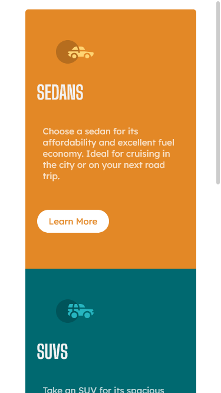
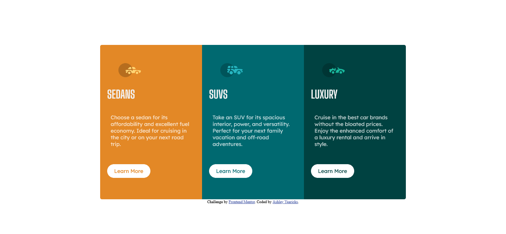

# Frontend Mentor - 3-column preview card component solution

This is a solution to the [3-column preview card component challenge on Frontend Mentor](https://www.frontendmentor.io/challenges/3column-preview-card-component-pH92eAR2-). Frontend Mentor challenges help you improve your coding skills by building realistic projects. 

## Table of contents

- [Frontend Mentor - 3-column preview card component solution](#frontend-mentor---3-column-preview-card-component-solution)
  - [Table of contents](#table-of-contents)
    - [The challenge](#the-challenge)
    - [Screenshot](#screenshot)
    - [Links](#links)
    - [Built with](#built-with)
  - [Author](#author)

### The challenge

Users should be able to:

- View the optimal layout depending on their device's screen size
- See hover states for interactive elements

### Screenshot

 

### Links

- Solution URL: [Github Repo](https://github.com/ayearicks/3-column-preview-card-component-main)
- Live Site URL: [Deployment](http://yearicks.dev/3-column-preview-card-component-main/)

### Built with

- Semantic HTML5 markup
- CSS custom properties
- CSS Grid

## Author

- Website - [Ashley Yearicks](https://yearicks.dev)
- Frontend Mentor - [@ayearicks](https://www.frontendmentor.io/profile/ayearicks)
- Twitter - [@jessarin5](https://www.twitter.com/jessarin5)
